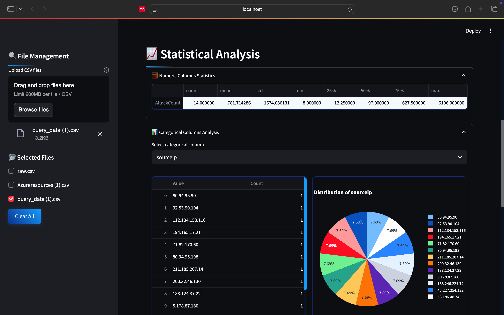
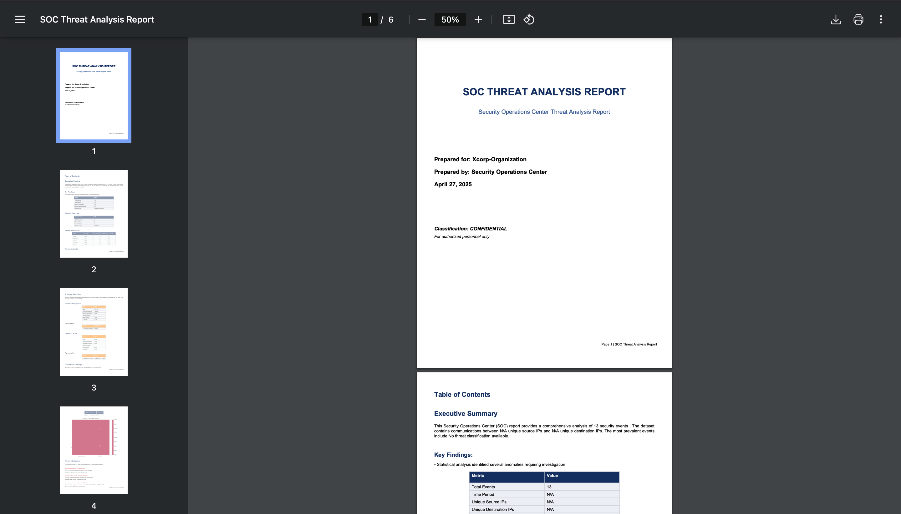
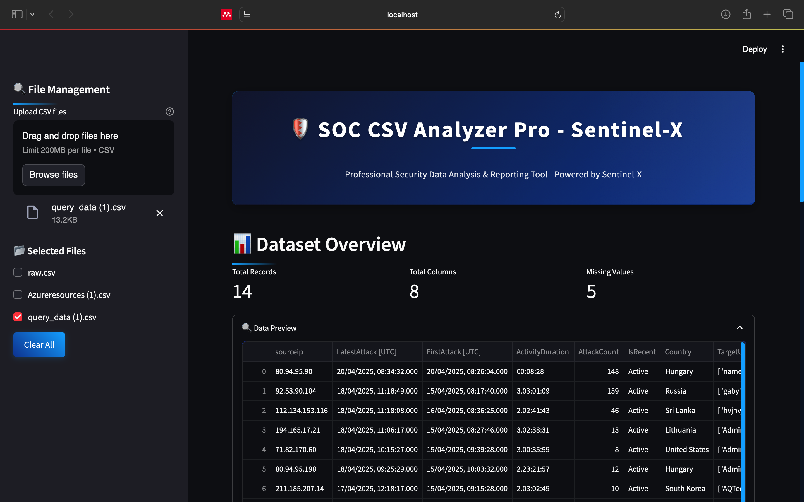

# SOC CSV Analyzer Pro 🛡️📊

**Professional CSV Analysis and Reporting Tool for Security Operations Centers**

---

## Table of Contents
- [Overview](#overview)
- [Key Features](#key-features)
- [Screenshots](#screenshots)
- [Installation](#installation)
- [Usage](#usage)
- [Report Customization](#report-customization)
- [Contributing](#contributing)
- [License](#license)

---

## Overview

SOC CSV Analyzer Pro is a powerful web application designed for security professionals to analyze, visualize, and report on security-related CSV data. Tailored for Security Operations Center (SOC) teams, this tool provides:

- Comprehensive data analysis capabilities
- Advanced data visualization options
- Professional PDF report generation
- Multi-file analysis in a single interface

Built with Python and Streamlit, this application ensures a user-friendly experience with a security-focused interface, making it an ideal solution for SOC analysts seeking in-depth insights from their data.

---

## Key Features

### 🔍 Data Management
- Upload and combine multiple CSV files
- Interactive file selection interface
- Automatic data type detection
- Missing value analysis

### 📈 Advanced Analysis
- Descriptive statistics for numeric columns
- Categorical data frequency analysis
- Correlation matrix visualization
- Basic anomaly detection (using z-scores)
- Time series analysis for datetime columns

### 📊 Interactive Visualizations
- Histograms, box plots, and violin plots
- Scatter plots with color coding
- Pie charts for categorical data
- Correlation heatmaps
- Anomaly visualization

### 📑 Professional Reporting
- Customizable PDF reports
- Multiple report sections to choose from
- Automatic table generation
- Embedded visualizations
- SOC-focused formatting

### 🛡️ SOC-Specific Features
- Security-focused UI design
- Anomaly detection alerts
- Combined log analysis
- Professional report templates

---

## Screenshots



*Comprehensive dashboard with data overview and visualizations*



*Customizable PDF report generation interface*



*User-friendly interface tailored for SOC teams*

---

## Installation

### Prerequisites
- Python 3.7+
- pip package manager

### Steps

```bash
git clone https://github.com/Lsam18/ai-soc-summary-SentinelX.git
cd ai-soc-summary-SentinelX
```

Install the required packages:

```bash
pip install streamlit pandas plotly reportlab seaborn matplotlib numpy
```

Run the application:

```bash
streamlit run soc_csv_analyzer.py
```

Open your browser and go to:

```
http://localhost:8501
```

---

## Usage

### Upload Files
- Click **"Upload CSV files"** in the sidebar.
- Select one or more CSV files from your system to start the analysis.

### Analyze Data
- View dataset overview and basic statistics.
- Explore visualizations like histograms, scatter plots, and heatmaps.
- Perform anomaly detection to identify potential security incidents.

### Generate Reports
- Choose sections to include (Overview, Anomaly Detection, etc.).
- Customize the report title and settings.
- Click **"Generate PDF Report"** to create a professional SOC report.
- Download the PDF report for sharing or documentation.

---

## Report Customization

You can select or deselect sections to include in the PDF report:
- Dataset Overview
- Statistical Analysis
- Visualizations
- Correlation Analysis
- Anomaly Detection
- Full Data Sample

You can also customize the report title directly through the interface.

---

## Contributing

We welcome contributions from the community! 🚀

1. Fork the repository.
2. Create a new feature branch:

```bash
git checkout -b feature/AmazingFeature
```

3. Commit your changes:

```bash
git commit -m "Add AmazingFeature"
```

4. Push to the branch:

```bash
git push origin feature/AmazingFeature
```

5. Open a Pull Request.

### Areas for Contribution
- Additional visualization types (e.g., network traffic graphs)
- Improved anomaly detection algorithms
- More SOC-specific report templates
- Enhanced SOC-oriented analysis features

---

## License

Distributed under the MIT License.  
See the [LICENSE](LICENSE) file for more information.

---

> **Empowering SOC Teams with Better Data Analysis!**
```
