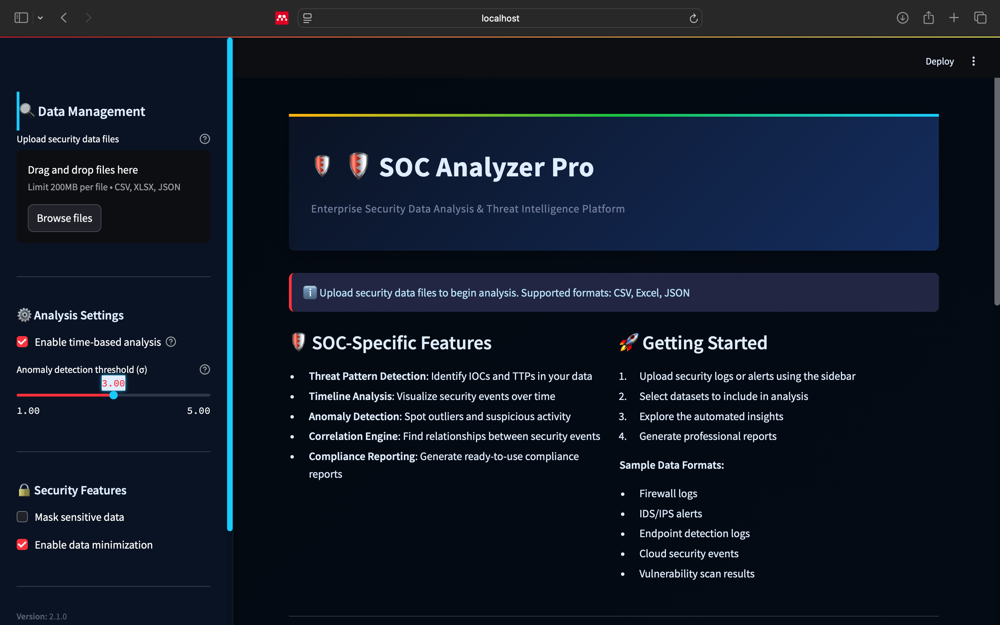

# SOC CSV Analyzer Pro 🛡️📊

**Professional CSV Analysis and Reporting Tool for Security Operations Centers**

## Table of Contents
- [Overview](#overview)
- [Key Features](#key-features)
- [Screenshots](#screenshots)
- [Installation](#installation)
- [Usage](#usage)
- [Report Customization](#report-customization)
- [Contributing](#contributing)
- [License](#license)

## Overview

SOC CSV Analyzer Pro is a powerful web application designed for security professionals to analyze, visualize, and report on security-related CSV data. Tailored for Security Operations Center (SOC) teams, this tool provides:

- Comprehensive data analysis capabilities
- Advanced data visualization options
- Professional PDF report generation
- Multi-file analysis in a single interface

Built with Python and Streamlit, this application ensures a user-friendly experience with a security-focused interface, making it an ideal solution for SOC analysts seeking in-depth insights from their data.

## Key Features

### 🔍 Data Management
- **Upload and Combine Multiple CSV Files**: Seamlessly analyze data from multiple sources.
- **Interactive File Selection Interface**: Intuitive file management for efficient workflow.
- **Automatic Data Type Detection**: Automatically detects and categorizes data types for accurate analysis.
- **Missing Value Analysis**: Easily identify and handle missing data points.

### 📈 Advanced Analysis
- **Descriptive Statistics**: Get a quick overview of all numeric columns, including mean, median, and standard deviation.
- **Categorical Data Frequency Analysis**: Analyze categorical data for patterns and trends.
- **Correlation Matrix Visualization**: Visualize relationships between variables for deeper insights.
- **Basic Anomaly Detection**: Detect outliers and unusual patterns using z-scores.
- **Time Series Analysis**: Analyze datetime columns for time-based trends and anomalies.

### 📊 Interactive Visualizations
- **Histograms, Box Plots, and Violin Plots**: Visualize distribution and spread of your data.
- **Scatter Plots with Color Coding**: Highlight relationships between variables with custom colors.
- **Pie Charts for Categorical Data**: Get a clear overview of proportions in categorical variables.
- **Correlation Heatmaps**: Identify correlations with a heatmap for better data insights.
- **Anomaly Visualization**: Quickly spot outliers with visual representations.

### 📑 Professional Reporting
- **Customizable PDF Reports**: Generate professional reports tailored to your needs.
- **Multiple Report Sections**: Choose from various sections to include in your reports.
- **Automatic Table Generation**: Create clean and formatted tables for better readability.
- **Embedded Visualizations**: Incorporate plots and charts directly into your reports.
- **SOC-Focused Formatting**: Reports designed with SOC teams' needs in mind.

### 🛡️ SOC-Specific Features
- **Security-Focused UI Design**: An interface optimized for SOC environments.
- **Anomaly Detection Alerts**: Receive alerts on suspicious activity in your datasets.
- **Combined Log Analysis**: Consolidate multiple logs into a single report for easier analysis.
- **Professional Report Templates**: Ready-to-use templates that cater to SOC reporting needs.

## Screenshots

  
*Comprehensive dashboard with data overview and visualizations*

  
*Customizable PDF report generation interface*

  
*User-friendly interface tailored for SOC teams*

## Installation

### Prerequisites
- Python 3.7+
- pip package manager

### Steps
1. Clone the repository:
   ```bash
   git clone https://github.com/Lsam18/ai-soc-summary-SentinelX.git
   cd ai-soc-summary-SentinelX

or the directory name after it gets downloaded!

### Install Required Packages:
```
pip install streamlit pandas plotly reportlab seaborn matplotlib numpy
```

### Run the Application:
```bash
streamlit run soc_csv_analyzer.py
```

Access the application in your browser at `http://localhost:8501`.

## Usage

### Upload Files:
- Click "Upload CSV files" in the sidebar.
- Select one or more CSV files from your system to start the analysis.

### Analyze Data:
- View the dataset overview, including basic statistics and data visualizations.
- Explore different visualizations like histograms, scatter plots, and correlation heatmaps.
- Utilize anomaly detection to identify potential security incidents in your data.

### Generate Reports:
- Select which sections to include in the report (e.g., Dataset Overview, Anomaly Detection, etc.).
- Customize the report title and other settings.
- Click "Generate PDF Report" to produce a professional SOC report.
- Download the PDF report for further analysis and presentation.

## Report Customization

The PDF report can be customized by selecting or deselecting the following sections:
- Dataset Overview
- Statistical Analysis
- Visualizations
- Correlation Analysis
- Anomaly Detection
- Full Data Sample

You can also edit the report title directly in the interface.

## Contributing

We welcome contributions from the security community! Here's how you can help:

1. Fork the repository
2. Create your feature branch (`git checkout -b feature/AmazingFeature`)
3. Commit your changes (`git commit -m 'Add some AmazingFeature'`)
4. Push to the branch (`git push origin feature/AmazingFeature`)
5. Open a Pull Request

### Areas for Contribution:
- Additional visualization types (e.g., network traffic graphs)
- Enhanced anomaly detection algorithms
- More report templates specific to SOC use cases
- SOC-specific analysis features, such as intrusion detection analysis

## License

Distributed under the MIT License. See `LICENSE` for more information.
