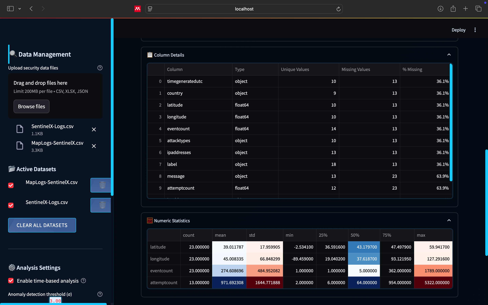

# SOC CSV Analyzer Pro 🛡️📊

**Professional CSV Analysis and Reporting Tool for Security Operations Centers**

## Table of Contents
- [Overview](#overview)
- [Key Features](#key-features)
- [Screenshots](#screenshots)
- [Installation](#installation)
- [Usage](#usage)
- [Report Customization](#report-customization)
- [Contributing](#contributing)
- [License](#license)

## Overview

SOC CSV Analyzer Pro is a robust web application designed for security professionals to analyze, visualize, and report on security-related CSV data. This tool provides SOC teams with:

- Comprehensive data analysis capabilities
- Advanced visualization options
- Professional PDF report generation
- Multi-file analysis in a single interface

Built with Python and Streamlit, this application offers a user-friendly interface with security-focused features tailored for SOC analysts.

## Key Features

### 🔍 Data Management
- Upload and combine multiple CSV files
- Interactive file selection interface
- Automatic data type detection
- Missing value analysis

### 📈 Advanced Analysis
- Descriptive statistics for all numeric columns
- Categorical data frequency analysis
- Correlation matrix visualization
- Basic anomaly detection using z-scores
- Time series analysis (for datetime columns)

### 📊 Interactive Visualizations
- Histograms, box plots, and violin plots
- Scatter plots with color coding
- Pie charts for categorical data
- Correlation heatmaps
- Anomaly visualization

### 📑 Professional Reporting
- Customizable PDF reports
- Multiple report sections to choose from
- Automatic table generation
- Embedded visualizations
- SOC-focused formatting

### 🛡️ SOC-Specific Features
- Security-focused UI design
- Anomaly detection alerts
- Combined log analysis
- Professional report templates

## Screenshots


*Comprehensive dashboard with data overview and visualizations*


*Customizable PDF report generation interface*


*User interface*

## Installation

### Prerequisites
- Python 3.7+
- pip package manager

### Steps
1. Clone the repository:
   ```bash
   git clone https://github.com/yourusername/soc-csv-analyzer.git
   cd soc-csv-analyzer
   ```

2. Install required packages:
   ```bash
   pip install -r requirements.txt
   ```

3. Run the application:
   ```bash
   streamlit run soc_csv_analyzer.py
   ```

4. Access the application in your browser at `http://localhost:8501`

## Usage

1. **Upload Files**:
   - Click "Upload CSV files" in the sidebar
   - Select one or more CSV files from your system

2. **Analyze Data**:
   - View dataset overview and statistics
   - Explore different visualizations in the tabs
   - Use anomaly detection for potential security events

3. **Generate Reports**:
   - Select which sections to include
   - Customize the report title
   - Click "Generate PDF Report"
   - Download the professional PDF

## Report Customization

The PDF report can be customized by selecting/deselecting sections:
- Dataset Overview
- Statistical Analysis
- Visualizations
- Correlation Analysis
- Anomaly Detection
- Full Data Sample

You can also edit the report title directly in the interface.

## Contributing

We welcome contributions from the security community! Here's how you can help:

1. Fork the repository
2. Create your feature branch (`git checkout -b feature/AmazingFeature`)
3. Commit your changes (`git commit -m 'Add some AmazingFeature'`)
4. Push to the branch (`git push origin feature/AmazingFeature`)
5. Open a Pull Request

### Areas for Contribution
- Additional visualization types
- Enhanced anomaly detection algorithms
- More report templates
- SOC-specific analysis features

## License

Distributed under the MIT License. See `LICENSE` for more information.

**Empowering SOC Teams with Better Data Analysis**
